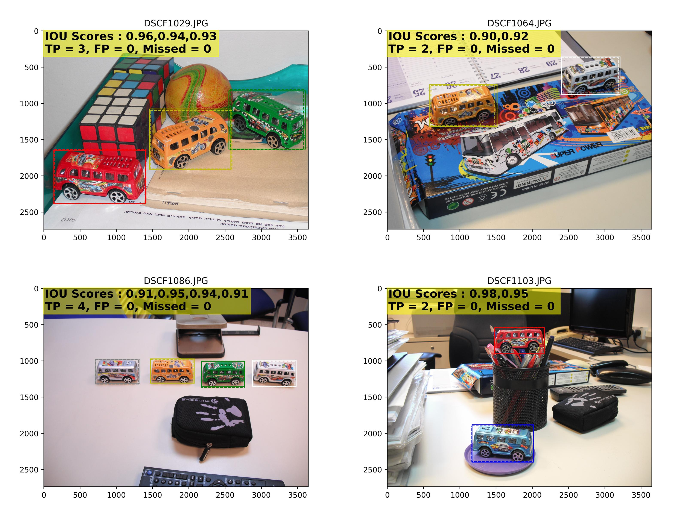
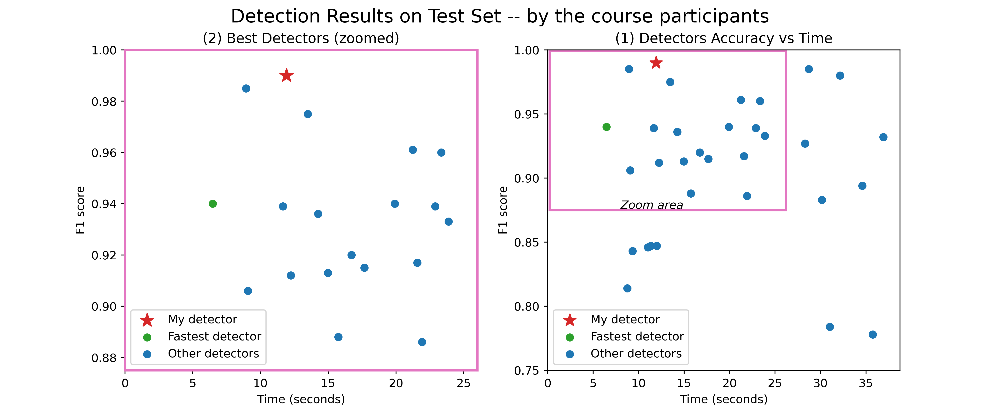
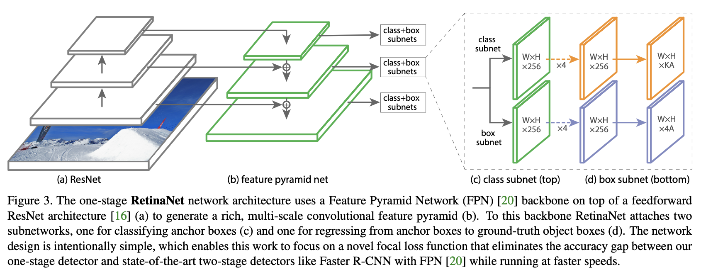

# Object Detection Project - Overview
Project in *Computer Vision* Course 2020 at **Tel-Aviv University, Israel.**

Overview of my object detection model implementation and results

:fire:  Buzzwords : `Deep-Learning`, `Computer-Vision`, `Object-Detection`, `CNN`, `PyTorch`

## Task Requirements:
* Detection of toy buses in images.
* Buses in 6 different colors to classify (green, yellow, white, gray,
blue, red).
* Achieve highest F1 score in minimal time.
 
**For example:**

  <i>4 Example images with the GT annotations and detector predictions.
   present the IOU, true positive, false positive and missed Detection for each image.</i>

## Detection Test Results
* The results of all detectors (implemented by the course participants) were compared.
* **My model achieved the highest F1 score** on Test dataset compare to all other implementations.

The following graph shows the Test results of the course participants:

Speed (s) versus accuracy (F1)

  <i>Compared detectors results. Closer to the upper left corner is the better (i.e. ideally score=1 in 0 seconds)
</i>

## Project details
* We get only a few dozen of images in total.
* A detection is considered as true positive (correct) if satisfies the conditions:
  * IOU > 0.7
  * Correct classification (correct color predicted).
  

## Implementation Details

  <i>T.-Y. Lin, P. Goyal, R. Girshick, K. He, and P. Dollar. Focal loss for dense object detection.
arXiv preprint arXiv:1708.02002, 2017.</i>

* I used RetinaNet model, PyTorch implementation at [yhenon/pytorch-retinanet](https://github.com/yhenon/pytorch-retinanet).
* Backbone: Resnet18 pre-trained, using *Transfer learning*.
* Massive data augmentations were used since a very low amount of examples were given.
* Implemented a custom dataset object for the training and evaluation (suited for the task).
* Implemented the inference structure and aggregating and saving detection results.
* The model was trained on the augmented data for 35 epochs.

